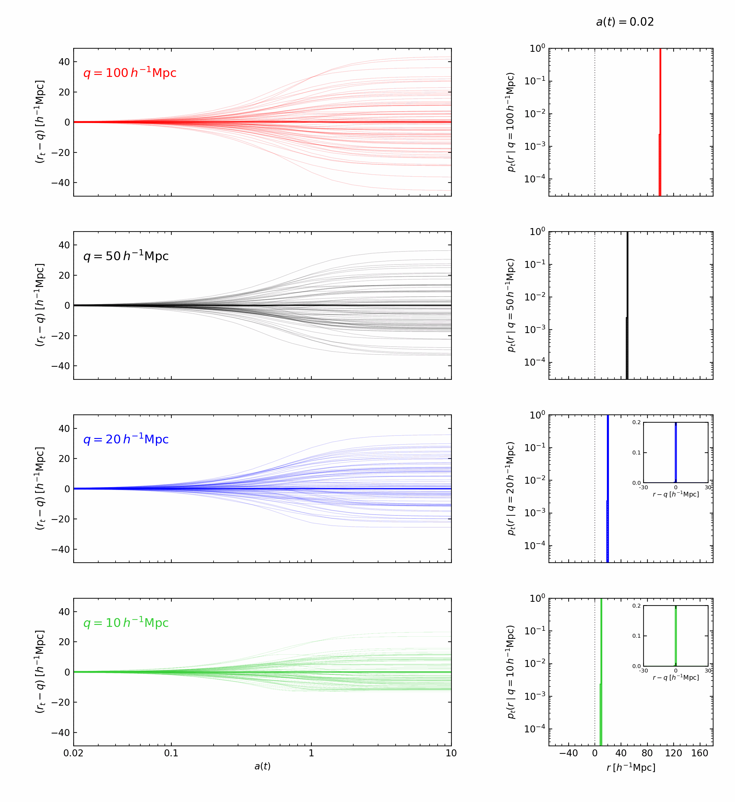

<p align="center">
  
</p>

Code to estimate the two-particle transition probabilities from a
1D cosmological N-body simulation with 1LPT initial conditions.
See arxiv:xxxx for paper.

## Run

Two options:

```sh
python run.py transitions
python run.py peak
```

* **transitions:** runs a set of simulations to estimate the transition histograms
  and the evolution of the first three separation cumulants.
  Stores 20 snapshots logspaced between a=0.02 and a=10,
  with four further snapshots at a=0.1, 0.3, 0.6, 1.0. 
* **peak:** runs another set of simulations to measure the evolution of the correlation
  function at five redshifts. Does not save transition pairs or full snapshots.

Both use the supplied Planck 2018 power spectrum table, growing-mode momenta,
the exact periodic rank-ordered force, and the same scale-factor-integrated
kick-drift-kick integrator. Positions are comoving; each equal-mass particle
represents a planar slab. No force softening in this one-dimensional simulation.

Change the settings file in `configs/` for different separations, bins, times, etc.

To remake figures without simulating:

```sh
python run.py transitions --plot-only
python run.py transitions --plot-only --linear-y
python run.py peak --plot-only
```

To change histogram binning without simulating, reanalyse the saved pairs:

```sh
python src/analyse.py data/transitions_N5000_R200_L1000 --histogram-bins 135
python plots/plot_transitions.py data/transitions_N5000_R200_L1000
```

## Notes

The transition initial cells have q/L = 0.10, 0.05, 0.02, 0.01 and width 0.001L.
Selection uses the actual initial Eulerian positions **after displacement**.
Every oriented non-self pair in `[q-width/2, q+width/2)` is followed by its
original particle labels through all crossings. Later separations use the
signed periodic interval `[-L/2, L/2)`.

